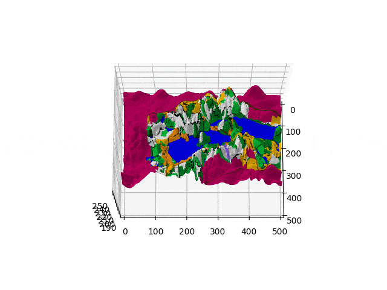
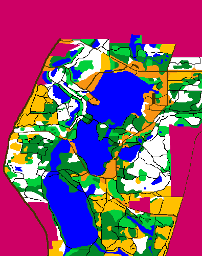
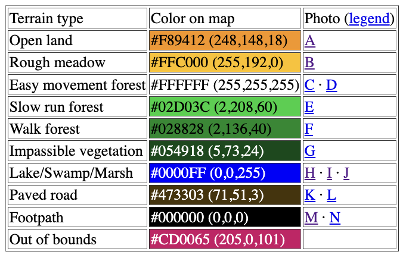

# PathMaster : 3D Terrain Optimizer

#### Overview
The goal of this project was to determine the optimal path for navigating a given terrain using the A* search algorithm. The task involved processing a terrain map, elevation data, and a sequence of checkpoints to find the shortest and most efficient path. This writeup details the key decisions made during implementation, focusing on the cost function, heuristic design, and overall solution structure.

#### Terrain Mapping and Cost Function
To represent the terrain, I created a function `map_rgb_to_terrain()` that maps RGB values from the terrain image to movement cost values. The terrain cost values were assigned as follows:

**Weights**

- **Open Land** (#F89412): 1.0
- **Rough Meadow** (#FFC000): 2.0
- **Easy Movement Forest** (#FFFFFF): 1.5
- **Slow Run Forest** (#02D03C): 2.5
- **Walk Forest** (#028828): 3.0
- **Impassable Vegetation** (#054918): ∞ (infinity)
- **Lake/Swamp/Marsh** (#0000FF): 20.0
- **Paved Road** (#473303): 1.2
- **Footpath** (#000000): 1.0
- **Out of Bounds** (#CD0065): ∞ (infinity)

The decision to use these values was based on the relative difficulty or ease of traversing each terrain type. For example, open land has the lowest cost due to minimal obstructions, while impassable vegetation and out-of-bounds areas have infinite cost, as they are not traversable.

#### Heuristic Function
For the heuristic, I used the Euclidean distance between the current node and the goal. This heuristic is admissible and consistent, as it never overestimates the true cost of reaching the goal. The Euclidean distance is calculated using the formula:

$h = \sqrt{(x_2 - x_1)^2 + (y_2 - y_1)^2}$

This heuristic provides a straight-line distance between two points, which is a good lower bound on the actual travel distance.

#### Cost Function
The total cost function `f(n)` for a node `n` is given by:

$
f(n) = g(n) + h(n)
$

Where:
- `g(n)`: Actual cost from the start node to the current node `n`.
- `h(n)`: Heuristic estimate of the cost from node `n` to the goal.

In my implementation, `g(n)` was calculated as the sum of the terrain-adjusted distance and the elevation difference. For diagonal movements, the base distance was calculated using the Pythagorean theorem, while for straight movements, it was the step size in either `x` or `y` direction. The cost was further adjusted by the terrain multiplier.

#### Node Class and Priority Queue
I defined a `Node` class to encapsulate each node’s state, including its position, parent, and cumulative cost values (`g`, `h`, and `f`). The nodes were managed using a priority queue (`heapq`), which allowed for efficient retrieval of the node with the lowest `f` cost.

#### A* Search Implementation
The A* search algorithm was implemented in the `astar()` function. The algorithm explores neighboring nodes in all eight possible directions (N, S, E, W, NE, NW, SE, SW). It skips nodes that are out of bounds, non-traversable, or already visited with a lower cost. For each valid neighbor, the algorithm computes the tentative `g` value and updates the priority queue if a lower cost path is found.

#### Elevation Handling
Elevation differences between the current node and neighboring nodes were incorporated into the `g` cost. I calculated the elevation difference and adjusted the distance metric accordingly:

$
\text{distance} = \sqrt{\text{base\_distance}^2 + \text{elevation\_difference}^2}
$

This adjustment ensures that the cost function reflects the difficulty of moving up or down a slope.

#### Input and Output Handling
1. **Input Files**: The program accepts four arguments: the terrain image, elevation file, path file, and output image filename. The elevation matrix was loaded by reading and parsing a text file, with special handling to ignore the last five values per line to align with the terrain matrix dimensions.

2. **Path Drawing**: Once the optimal path is found, it is drawn onto the terrain image using the `color_path_on_image()` function, with a distinct color (#763fe7) to clearly indicate the chosen path.

3. **Output**: The program outputs the total path distance in meters to the terminal and saves the modified image with the optimal path drawn.

#### Challenges and Justifications
1. **Terrain Mapping**: The main challenge was correctly mapping RGB values to terrain types due to potential variations in color representation. I implemented a function to find the closest match based on color differences, ensuring accurate terrain mapping.

2. **Heuristic Consistency**: The chosen heuristic (Euclidean distance) is consistent, as the estimated cost to reach the goal never decreases along a path. This ensures that A* always finds the optimal path.

3. **Elevation Impact**: Correctly integrating elevation into the cost function was crucial to reflect realistic travel costs. Using a combined distance metric with terrain multipliers, I accounted for both elevation changes and terrain types, which is essential for a reliable solution.

#### Conclusion
The implemented solution successfully navigates the given terrain, incorporating both terrain and elevation data. The use of A* with a consistent heuristic guarantees optimal pathfinding. The program handles input and output as specified, generating a visual representation of the path on the terrain image and printing the total distance to the terminal.